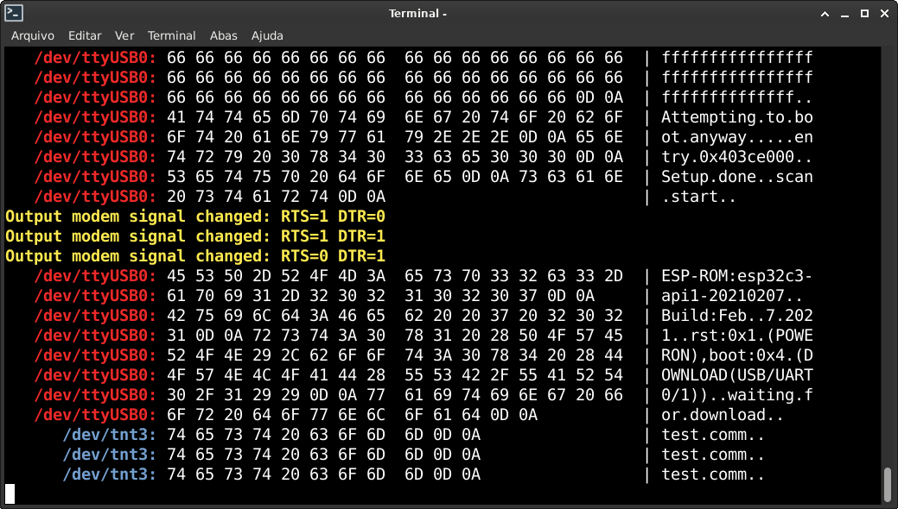

# tty0tty

_linux null modem emulator v1.4_

## Directory tree

This is the tty0tty directory tree:

* `module`  : linux kernel module null-modem
* `pts`     : null-modem using ptys (without handshake lines)
* `debian`  : debian package build tree
* `ssniffer`: simple serial sniffer using tty0tty driver ports

### pts (unix98)

When run connect two pseudo-ttys and show the connection names:

    (/dev/pts/1) <-> (/dev/pts/2) 

the connection is:

    TX -> RX
    RX <- TX

### module

The module is tested in kernels from 3.10.2 to 5.3.15 (debian) 

When loaded, create 8 ttys interconnected:

    /dev/tnt0  <->  /dev/tnt1 
    /dev/tnt2  <->  /dev/tnt3 
    /dev/tnt4  <->  /dev/tnt5 
    /dev/tnt6  <->  /dev/tnt7 

the connection is:

    TX   ->  RX
    RX   <-  TX
    RTS  ->  CTS
    CTS  <-  RTS
    DSR  <-  DTR
    CD   <-  DTR
    DTR  ->  DSR
    DTR  ->  CD
  
### ssniffer

This is a simple serial sniffer program supporting handshake lines (using tty0tty module) with two working modes. 
In normal mode the data is displayed on the console as in the figure below. 
In ysplitter mode a third virtual port is connected and has access to the data sent
 by the device port and by the control application.

  

## Precompiled .deb packages

You can get precompiled tty0tty dkms module or ssniffer packages from the [piduino.org](http://apt.piduino.org) repository for Debian or Ubuntu :

    wget -O- http://www.piduino.org/piduino-key.asc | sudo apt-key add -
    sudo add-apt-repository 'deb http://apt.piduino.org buster piduino'
    sudo apt update

The repository added in the `add-apt-repository` command is for the 
Debian Buster distribution, but you can also choose **bullseye**, 
**bionic**, **focal** or **jammy**.  
These repositories provide packages for the **amd64**, **armhf** and 
**arm64** architectures.

If the `add-apt-repository` command fails, install the `software-properties-common` package like this:

    sudo apt install software-properties-common

### module

    sudo apt install tty0tty-dkms

### ssniffer

    sudo apt install ssniffer

## Build from source

### module

for module build is necessary kernel-headers or kernel source:

    sudo apt-get  update
    sudo apt-get  install linux-headers-`uname -r`
    cd module
    make
    sudo make install

for debian package:

    sudo apt-get install devscripts build-essential lintian debhelper

Download the archive file from https://github.com/lcgamboa/tty0tty/archive/refs/heads/master.zip

    wget https://github.com/lcgamboa/tty0tty/archive/refs/heads/master.zip
    unzip master.zip
    cd tty0tty-master
    dpkg-buildpackage

to clean:

    dh_clean

`make install` set the devices permissions automatically in udev creating the file /etc/udev/rules.d/99-tty0tty.rules with rules:

    SUBSYSTEM=="tty", KERNEL=="tnt0", GROUP="dialout", MODE="0660"
    SUBSYSTEM=="tty", KERNEL=="tnt1", GROUP="dialout", MODE="0660"
    SUBSYSTEM=="tty", KERNEL=="tnt2", GROUP="dialout", MODE="0660"
    SUBSYSTEM=="tty", KERNEL=="tnt3", GROUP="dialout", MODE="0660"
    SUBSYSTEM=="tty", KERNEL=="tnt4", GROUP="dialout", MODE="0660"
    SUBSYSTEM=="tty", KERNEL=="tnt5", GROUP="dialout", MODE="0660"
    SUBSYSTEM=="tty", KERNEL=="tnt6", GROUP="dialout", MODE="0660"
    SUBSYSTEM=="tty", KERNEL=="tnt7", GROUP="dialout", MODE="0660"

It's possible edit rules and create permanent symbolic names with the parameter SYMLINK:

    SUBSYSTEM=="tty", KERNEL=="tnt0", GROUP="dialout", MODE="0660", SYMLINK+="ttyUSB10"
    SUBSYSTEM=="tty", KERNEL=="tnt1", GROUP="dialout", MODE="0660", SYMLINK+="ttyUSB11"

The user must be in the dialout group to access the ports. 
To add your user to dialout group use the command:
 
    sudo usermod -a -G dialout your_user_name

after this is necessary logout and login to group permissions take effect.

To dkms support use the scripts `dkms-install.sh` and  `dkms-remove.sh`

### pts

    cd pts
    make

then run with:

    ./tty0tty
    
### ssniffer

    cd ssnifer
    make
    make install

for debian package:

    dpkg-buildpackage

then for normal mode run with:

    ssniffer /dev/ttyUSB0 2 color
and connect application in /dev/tnt3 virtual port.   
    
    
 Or for ysplitter mode run with:
 
    ssniffer /dev/ttyUSB0 2 ysplitter4
and connect application in /dev/tnt3 virtual port and second terminal in /dev/tnt5 virtual port.    
       
    
For e-mail suggestions :  lcgamboa@yahoo.com
